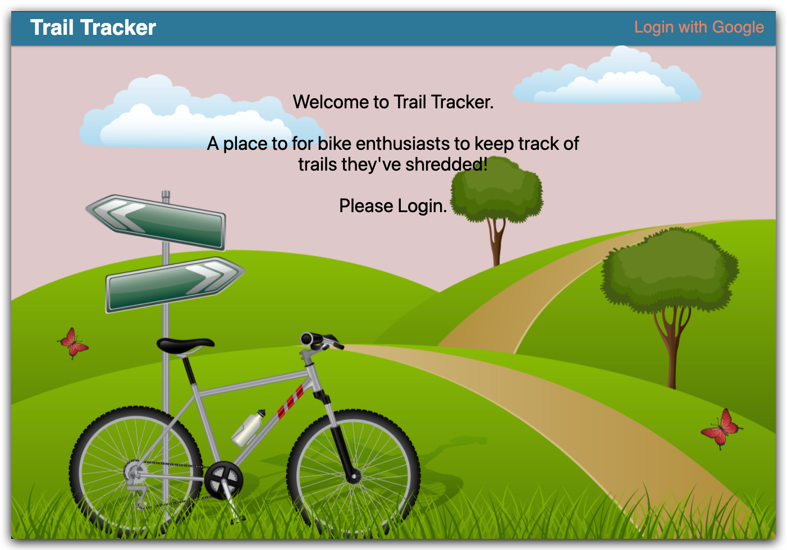
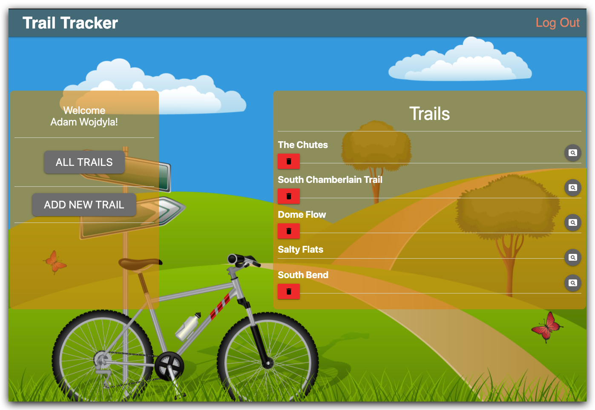
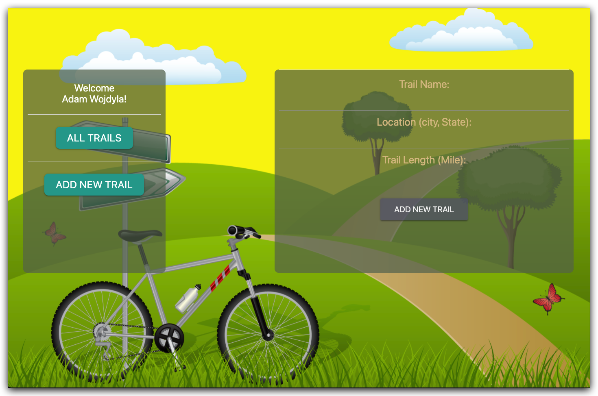
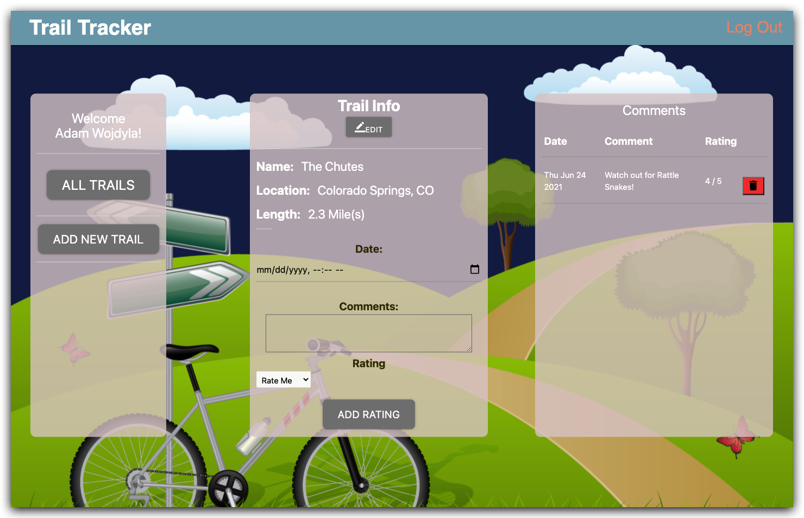

# Trail Tracker

Trail Tracker is a useful App that gives the ability for a trail enthusiast to keep track of the trails they have ventured on!

## Wireframe ScreenShots

## Technologies Used

- JavaScript
- EJS
- HTML
- CSS
- Mongoose
- MongoDB
- Node.js
- Express.js

---

## Getting Started

- When the app loads please log into Google on the top right of the menu.

---

### Links to Trail Tracker and Trello Board

[Trail Tracker](https://project2comp.herokuapp.com/users)

[Trello Board](https://trello.com/b/dZ2K18qn/trail-tracker)

---

## Next Steps

1. Create functionality to edit entire trail information based on logged in user.
2. Create functionality to edit comments based on logged in user.
2. Connect database of known trails for logged in users to search from and add to their profile. 

